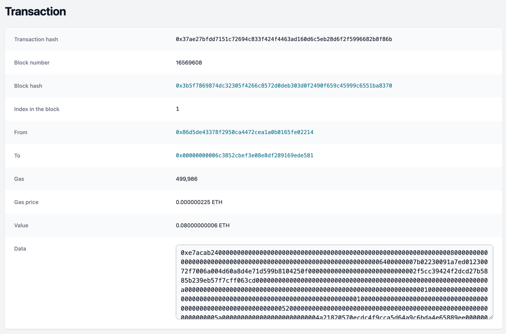

# Explorer

Simple Ethereum explorer to search and inspect blocks and transactions. 


### Features

<details>
  <summary>Inspect blocks</summary>
  
</details>

<details>
  <summary>Inspect transactions</summary>
  
</details>

<details>
  <summary>Search blocks and transactions</summary>
  
</details>

### Quikstart

```
$ ./start.sh
```

Starts on http://localhost:3000

### Architecture

Backend connects to an Ethereum RPC and loads blocks to MongoDB:
- listens to new blocks
- on startup loads 300 last blocks (`ETH_LAST_BLOCKS_COUNT`) 

## Development
```
// Start mongodb
docker-compose up mongodb -d

// Start backend 
$ cd backend && npm install && npm run start:dev
 
// Start frontend
$ cd frontend && npm install && npm run dev
```

### Stack
Backend [NestJS](https://docs.nestjs.com/), database [MongoDB](https://docs.nestjs.com/techniques/mongodb#mongo), frontend  [RemixJS](https://remix.run/), styling [Tailwind CSS](https://tailwindcss.com/), Ethereum JSON-RPC [Web3.js](https://www.npmjs.com/package/web3)


### OpenAPI generation

Frontend generates an OpenAPI client to `./frontend/generated-sources/openapi`
and includes this as a local NPM library. 

```
// Start backend to expose http://localhost:3001/swagger-json
$ cd backend && npm install && npm run start:dev

// Generate ./frontend/generated-sources/openapi
$ cd frontend && npm run generate-openapi-client

// Use new OpenAPI client in frontend code and commit to Git
```

### Contributions
PRs and issues are welcome! Code is [Apache 2.0 licensed](./LICENSE)